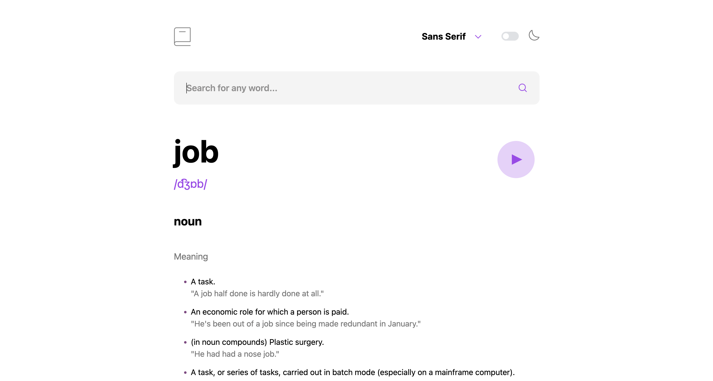

Dictionary API is a dynamic web application built with React, designed to provide word definitions, pronunciations, and related information by integrating with a dictionary API (e.g., DictionaryAPI.dev). It features search functionality, a theme toggle for light and dark modes, font switching for different typography styles, and a responsive design optimized for mobile and desktop.

